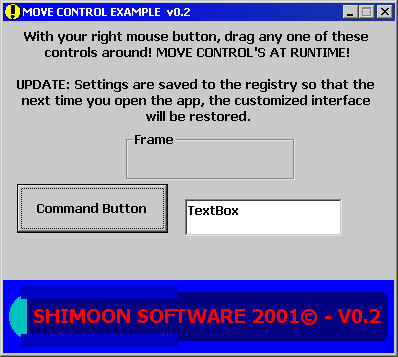



## Move controls at runtime \- new version 0\.2

### Description

An update to my code on how to move controls at runtime. With version 0.2, the program saves all the settings to the registry, so that the next time a user opens the application, the settings will be restored.

PLEASE VOTE IF YOU LIKE IT

Armen Shimoon
 
### More Info
 

             |
---                |---
**Submitted On**   |2001-05-11 09:53:10
**By**             |[Armen Shimoon](https://github.com/Planet-Source-Code/PSCIndex/blob/master/ByAuthor/armen-shimoon.md)
**Level**          |Intermediate
**User Rating**    |3.9 (31 globes from 8 users)
**Compatibility**  |VB 6\.0
**Category**       |[Miscellaneous](https://github.com/Planet-Source-Code/PSCIndex/blob/master/ByCategory/miscellaneous__1-1.md)
**World**          |[Visual Basic](https://github.com/Planet-Source-Code/PSCIndex/blob/master/ByWorld/visual-basic.md)
**Archive File**   |[Move contr195095112001\.zip](https://github.com/Planet-Source-Code/armen-shimoon-move-controls-at-runtime-new-version-0-2__1-23116/archive/master.zip)

